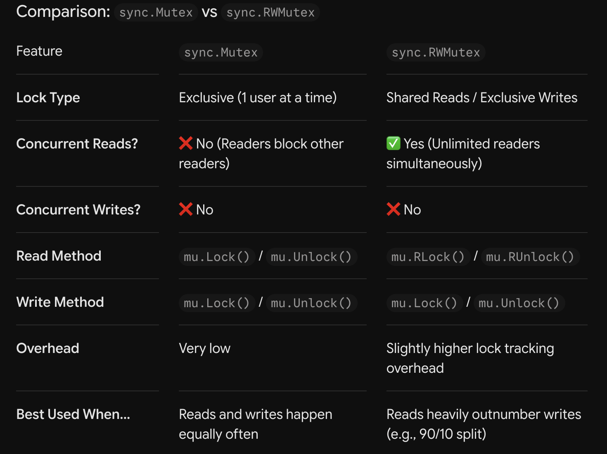

# All About GO
__Golang__ is an open-sourced _statically_ (code is checked before runtime) typed, _compiled_ (translates code to binary code) programming language. It compiles faster than _Rust_, _C_, and _Zig_ but runs slower than them. It was created by system engineers at __Google__ (Ken Thompson, Rob Pike, Robert Griesemer) to provide better performance through speed, scaling, trivial concurrency, and readability than their previous infrastructure. It was designed to be used in network and backend infrastructures but can be used anywhere really.

Although Go is lightweight, its programs produce extra memory that is stored in the _executable binary_ that the __Go Runtime__ cleans up, as it includes a _garbage collector_.

While the `func main() {}` is the main function of the program and the entry point, the __package main__ at the top tells the Go compiler that the code has to be run and compiled as a standalone package. The `import fmt` imports the formatting package from the _standard library_ which allows things like `fmt.Println()` to be used.

```bash
brew install go

go version
which go
```
To run Go a folder has to be initialised with a module file tracking dependencies:
```bash
go mod init structs-demo
```
The `go.mod` file is a plain text file that declares the unique path of your module and states the version of Go your code requires. Historically, Go forced developers to put all their code inside one giant global system folder (the old $GOPATH). Go Modules changed this. A go.mod file tells the Go compiler: "Treat this specific folder as an isolated, self-contained workspace. Any files inside this folder belong to this project." Without it, the compiler cannot track imports or handle third-party libraries. Scripts cannot have _test_ in them as in `struct_test.go`.

Linting is the process of using a specialized tool, known as a linter, to perform static code analysis on source code without executing it.  The primary goal is to automatically detect programming errors, stylistic inconsistencies, and suspicious patterns that compilers or tests might miss, ensuring code adheres to predefined quality and style standards.
```bash
brew install golangci-lint

# Run in the same location as go.mod
golangci-lint run
# Run on the current directory only (excluding subdirectories)
golangci-lint run ./...

# Run on a specific file
golangci-lint run main.go

# Fix: Some linters support automatic fixing
golangci-lint run --fix
```
By default, golangci-lint runs a core set of standard linters (errcheck, gosimple, govet, ineffassign, staticcheck, unused). To enable additional linters on the fly:
```bash
# Enable specific extra linters like bodyclose or revive
golangci-lint run -E bodyclose,revive
```

Go __comments__ serve a dual technical purpose: they are structural documentation. The built-in tool `go doc` parses your comments automatically to generate documentation for your code packages.
```go
// In-line: use for functions and most other things
/* Block: for package-specific */

// Package-level and functions for docs start with the package or function name and ends with a dot.
package rain
```
What and Why GO
History
Setup
Comments

__Contents__ to master:
- [Basics](#understand-the-basics)
- [Composite Types](#composite-types)
- [Conditionals and Loops](#making-decisions-and-loops)
- [Functions](#functions)
- [Pointers](#pointers)

## Understand the Basics
### 📇 Variables and Constants
For memory safety variables are explicitly bound to a specific data and there are two syntax used for declaring them:
- __Standard Declaration__: Uses the `var` keyword, explicitly state the name, type, and optional value. This allows a developer to initialise a variable without a value or create one at the package level (outside functions).
- __Shorthand Declaration__: Used inside blocks like functions and loops to provide clean and readable code. It does not specify a type as the compiler would infer the type based on the value at the right of walrus operator`:=`.
```go
package main
import "fmt"


var name string = "Someone Like You"
var (
    age int = 40
    available bool = True
)

func main() {
    // Standard declaration inside a function (often used when value is unknown yet)
	var operationalLimit int
	operationalLimit = 500

	// Shorthand declaration (Type inferred as string)
	environmentName := "Staging_Cluster"
}
```
If a variable is declared with `var` without a value the GO compiler assigns a __Zero Value__ to it instead of undefined like most languages.

Go uses lexical block scoping enforced by curly braces {}. Variables declared inside an inner block (like an if statement, for loop, or function) are invisible to the outer blocks. __Shadowing__ occurs when you declare a variable in an inner block with the exact same name as a variable in an outer block. The inner variable "shadows" (hides) the outer variable, meaning changes inside that block do not affect the outer scope.

___Critical Rules of Go Variables___:
- The Unused Variable Constraint: The Go compiler strictly treats unused local variables as a build error. If you declare a variable inside a function and do not read from it, your program will refuse to compile. This keeps binary sizes lean and stops dead code accumulation.
- The Blank Identifier (_): If a function returns multiple values (such as data and an error) and you do not need one of those variables, you must assign it to the blank identifier _ to discard it safely without triggering the unused variable compiler error.

__Constants__ are static primitive values that cannot be changed or re-assigned. They are declared using the `const` keyword and the assignment operator not the _walrus_. They can also be grouped with `()`. They have to be computed at compile time, therefore using things like `time.Now()` would not work for a constant.
```go
package main
func main() {
	const Hello = "Hello World!"
} 
```

When it comes to formatting in go there are two ways in which it can be done using the `fmt` package:
- `fmt.Printf()`: Prints to the standard out
- `fmt.Sprintf()`: returns the formatted string

The default symbol is the `%v` which returns any value, while `%s`, `%d`, and `%f` are for string, integers, and floats respectively. The `%T` tells the type of a value.
```go
s := fmt.Sprintf("You have %.2f points", 98.4658)
// You have 98.47 points

fmt.Printf("The type of penniesPerText is %T\n", penniesPerText)
```
[_learn more formatting_](https://pkg.go.dev/fmt#hdr-Printing)

### 🗑️ Basic Data Types
__Signed__ and __Unsigned__ integers are numeric values that do not have decimals where unsigned are only positive values. The figure after the `int` or `uint` respresents the number of bits which is the size of the value:
- __Signed__: int (32 or 64 bits based on user environment), int8, int16, int32, int64
- __Unsigned__: unit, uint8, uint16, uint32, uint64
- __Float__: float32, float64 (use)
- __Complex__: complex64, complex128 (use)
- __Byte__: byte an alias of uint8
- __Rune__: rune an alias of int32

```go
// Convert from float64 to int64
temperatureFloat := 88.26
temperatureInt := int64(temperatureFloat)
```
With number types, only differ from the defaults if its absolutely necessary like for performance and memory.


### 🎥 Documentation and Commands in GO

## Composite Types
### Arrays
An __array__ is a fixed sized block of continguous memory that cannot be changed:
```go
var someInts [10]int // Array of ten integers
// Initialised literal
primes := [6]int{2, 3, 5, 7, 11, 13}
```
### Slices
__Slices__ are dynamically-sized arrays, where _non-nil_ slices always have an underlying array.
```go
// Explicitly create a slice on top of an array
primes := [6]int{2, 3, 5, 7, 11, 13}
mySlice := primes[1:4]
// mySlice = {3, 5, 7}
``` 
The __length__ of a slice is the number of elements, while the __capacity__ is the length of the underlying array. A slice can be created using the `make()` function where the integer in the brackets are ommited; as if they were included, then the structure would be an array.
```go
mySlice := make([]string, 5, 10) // Len: 5, Cap: 10
// The capacity can be omitted
// Using a slice literal
mySlice := []string{"You", "me", "happy"}
```
Elements can be assigned and accessed using __indexing__ through bracket notation
```go
mySlice[2] = "somewhere" // {You, me, somewhere}
```
Function can be __variadic__ where they take any number of arguments.
```go
func sum(nums ...int) int {
	total := 0

	for _, num := range nums {
		total += num
	}
	return total
}

// Spread operator
numbers := []int{1, 2, 3}
sum(numbers...)
```
The variadic `append()` function is used to add elements to a slice. If the underlying array is full, it automatically creates a new one:
```go
slice = append(slice, oneThing)
slice = append(slice, firstThing, secondThing)
slice = append(slice, anotherSlice...)
```

Slices can easily be iterated over:
```go
for index, element := range slice {}
// These can also be nested and _ can be used if the index is not needed.
```
Slices can also contain other slices to create a __matrix__ od 2D element:
```go
rows := [][]int{}
rows = append(rows, []int{1, 2, 3})
rows = append(rows, []int{4, 5, 6})
fmt.Println(rows)
// [[1 2 3] [4 5 6]]

func createMatrix(rows, cols int) [][]int {
	matrixRows := [][]int{}

	for i := 0; i < rows; i++ {
		// Create a brand NEW row slice for every outer loop iteration
		columnValues := []int{}

		for j := 0; j < cols; j++ {
			value := i * j
			columnValues = append(columnValues, value)
		}

		// Append the completed row slice directly
		matrixRows = append(matrixRows, columnValues)
	}

	return matrixRows
}
```
### Strings
Two strings can be concatenated with the `+` operator but string and an int or float64 cannot. 

### Maps
__Maps__ are unordered __key-value__ pair structures, similar to _hash tables_ and _dictionaries_ in other languages. They let you look up values using unique keys with incredibly fast $O(1)$ constant time complexity. A _map_ can be created in 3 main ways:
```go
// 1. Zero Value (Nil Map) — DANGER
var m1 map[string]int 

// 2. Using make() — PREFERRED
m2 := make(map[string]int)

// 3. Map Literal — PREFERRED for initial data
m3 := map[string]int{
    "alice": 25,
    "bob":   30,
}
```
_Reading_ from an uninitialised is safe and returns zero-values, but _writing_ to it causes a __runtime panic__.

Elements can be accessed, inserted, and deleted easily with maps:
|Mutation        | Example                |
|:--------------:|:-----------------------|
|__Insert__ | `myMap[key] = value` |
|__Access__ | `value = myMap[key]` |
|__Delete__ | `delete(myMap, key)` |
|__If Exists__ | `value, ok := myMap[key]` |

For _map_ data structures, __values__ can be anything, however __keys__ must be __comparable (==, !=)__ types like int, float64, string, user-defines structs, bool, pointer, channels, and interfaces. it cannot be functions, maps, slices, or stucts of maps and slices.

To see if a value exists or if a _key_ returns 0 (entry does not exist), the __comma ok__ idiom is used:
```go
// Read returns two values: (value, exists)
val, ok := ages["Alex"]
if !ok {
    fmt.Println("Key 'Alex' does not exist in the map!")
}

// Compact idiomatic form:
if val, ok := ages["Chris"]; ok {
    fmt.Println("Chris is found, age:", val)
}
```
The best way to iterate over maps is `for key, value := range map {}`:
```go
inventory := map[string]int{
    "apples":  10,
    "bananas": 5,
    "oranges": 8,
}

for item, count := range inventory {
    fmt.Printf("%s: %d\n", item, count)
}
```
_Note_: Go explicitly randomises the starting index when iterating through maps with _range_ so developers would not have to write code that depends on map orders. If you need __deterministic order__, extract the keys into a slice, sort the slice, and loop over the slice! __Maps__ can have __ONLY ONE VALUE__ associated with keys.

Mops can also be nested:
```go
map[string]map[string]int
map[rune]map[string]int
map[int]map[string]map[string]int
```

#### Maps Under The Hood
__Maps__ are similar to _slices_ in that they are references, so if they are modified within a function, they changed the _caller's_ map.

There can be a _concurrency_ danger in Go as _maps_ are not thread-safe (behaves correctly when accessed by threads), therefore if goroutine reads from a map, while another goroutine writes to it simultaneously, the program would crash with an unrecoverable panic: `fatal error: concurrent map writes`. For concurrent access maps must be protected using `sync.RWMutex` or `sync.Map`.

In Go, a map is a pointer to a runtime struct called `hmap`:
- __Buckets__: A Go map consists of an array of buckets (each bucket holds up to 8 key-value pairs).
- __Hashing__: When you do `m["key"]`, Go hashes "key" into a 64-bit integer.Part of the hash determines which bucket to look in. Another part of the hash (Top Hash) identifies the key inside the bucket.
- __Growing__: When buckets get too full (Load Factor $\approx 6.5$), Go automatically allocates a new bucket array (2x capacity) and incrementally copies elements over.
- __Pre-allocation Performance Tip__: Like slices, maps re-hash and resize as they grow. If you know you need to store ~1,000 items, pre-allocate space to avoid runtime re-allocation costs:
```go
// Pre-allocates space for ~1000 entries
userScores := make(map[string]int, 1000)
```


## Structs
__Structs__ are used to represent structured data where data that needs to be grouped into a single unit can be placed there. __Go__ rejects OOP, avoiding inheritance hierachies and heavy virtual-table objects, therefore, structs are used. Structs operate at both ends of the abstraction spectrum:
1. __High-level__: It acts as an object where methods and complex behaviours can be attached using embedding
2. __Low-level__: It maps directly to physical CPU memory. You control the exact byte layout, stack vs. heap allocation, and how the data aligns with hardware caches.
Simple declaration:
```go
type Her struct {
	name string
	age int
	available bool
}
// Use a literal to create an instant
eba := Her {name: Eba, age: 40, available: false}
``` 
It is similar to dictionaries and objects in other programming languages. Structs can be created without specifying the fields, however, each value must be in the correct order. Structs can be nested where the fields can be accessed using the dot operator:
```go
type Her struct {
	name string
	age int
	available bool
	home house
}

type building struct {
	rooms int
	lightType string
}

tara := Her {tara.home.rooms = 5}
```
While _Java or Python_ use complex class hierarchies, Go champions __composition__ over inheritance. Instead of a class inheriting from a parent class, Go structs use struct __embedding__ (anonymous fields) to compose behaviors. If you embed struct `A` inside struct `B`, all of A's fields and methods are "promoted" to B. It looks and acts like inheritance to the caller, but under the hood, it is pure, __flat composition__. This means the extra dot notation needed to access fields like in the nested struct is not need; you directly access like normal. There are two ways to attach behaviour using __method receivers__:
1. __Value Receivers__ (func (u User)): The method receives a complete copy of the struct. Safe from side effects, but incurs copy overhead for large structs.
2. __Pointer Receivers__ (func (u *User)): The method receives a pointer to the original struct. This allows you to modify the original data and avoids copying memory.

A receiver is a function where the parameter goes before the name of the function. It is used to provide interfaces that structs and other data types can implement:
```go
func (r rect) area() int {
	return r.width * r.height
}
// struct
var r = rect{width: 5, height: 10,}
```
Structs can be anonymous which can be used when they are intended to be used once. To create an anonymous struct, just instantiate the instance immediately using a second pair of brackets after declaring the type:
```go
myCar := struct {
  brand string
  model string
} {
  brand: "Toyota",
  model: "Camry",
}
```
Anonymous structs can also be used in other structs.

There are a few ways in which structs can be broken:
1. __The Value Receiver (Silent Bug)__: A method that is supposed to modify the state of a struct which forget the asterisk will compile fine but no changes will be applied.
2. __Method Set/ Interface Trap__: Go's compiler has strict rules about "Method Sets". If an interface requires a method, and you implement that method with a pointer receiver, a value type cannot satisfy that interface.
3. __Ambiguity Collissions in Embedding__: If you embed two different structs that happen to share a field name, Go compiles fine. However, the moment you attempt to access the promoted field, the compiler panics due to ambiguity. Use dot notation to be explicit.

### Structs at the Hardware Level
At the hardware level, the operating system and CPU don't read memory 1 byte at a time. Modern 64-bit CPUs (like Apple Silicon or Intel/AMD x86-64) read memory in words of 8 bytes. To optimize access speed, every primitive type has an alignment guarantee. For example, a 64-bit integer (int64) must start at a memory address that is a multiple of 8. If you place a 1-byte boolean right before an 8-byte integer, the compiler will insert 7 "invisible" empty bytes of _padding_ to ensure the integer starts at an 8-byte boundary. If it didn't pad, the integer would be "misaligned" (straddling two 8-byte words), forcing the CPU to make two memory cycles instead of one just to read a single integer.

Structs sit in memory in a contiguous block, with fields placed one after the other, where the order of fields is important:
```go
type stats struct {
	NumPosts uint8
	Reach    uint16
	NumLikes uint8
}
```
Go will add padding to make up for the size difference which is done for execution speed. The reflect package can be used if there is concerns to debug the memory layout of a struct or manually align fields from largest to smallest:
```go
typ := reflect.TypeOf(stats{})
fmt.Printf("Struct is %d bytes\n", typ.Size())
```

Go's compiler lets you attach literal metadata string __tags__ to fields (e.g., json:"id"). Go frameworks use the standard __reflect__ library at runtime to parse these tags. This is how JSON serialization, database ORMs, and configuration binders inspect and map structural data.

Empty structs are the smallest possible type in Go as they take up 0 bytes of memory. They are used as _unary_ values useful for:
1. __Set Implementations__: Using a map where you only care about keys: `map[string]struct{}`. This consumes far less memory than `map[string]bool`.
2. __Channel Signaling__: Sending a pure signal without allocating memory: `chan struct{}`.

```go

// anonymous empty struct type
empty := struct{}{}

// named empty struct type
type emptyStruct struct{}
empty := emptyStruct{}
```


## Making Decisions and Loops
### ❓ Conditionals
The code of a condition is executed only if the statement is true. In _Go_ the `if/else` keywords do not need parentheses but they need brackets on the same line as the condition. Variables can also be declared in the statement.
```go
if age := 41; age < 30 {
	fmt.Println(age, "is not in the dating bracket")
} else if age > 27 && age < 35 {
	fmt.Println(age, "not too sure")
} else {
	fmt.PrintLn(age, "is perfect")
}
```
An _if_ statement can be combined with an assignment operation to use the variable inside an if block:
```go
names := map[string]int{}
missingNames := []string{}

if _, ok := names["Denna"]; !ok {
    // if the key doesn't exist yet,
    // append the name to the missingNames slice
    missingNames = append(missingNames, "Denna")
}
```

For __switch__ statements in Go, the _break_ keyword is not required at the end of the __case__, as its implicit. However, the `fallthrough` statement can be used if a case has to fall through to another.
```go
switch someone {
case "No one":
	message = "Keep looking"
case "Her":
	message = "You deserve happiness"
default:
	message = "I guess not in this lifetime"
}
```
### ⭕️ Iterations
A __loop__ is a unified control structure used to execute a block of code repeatedly based on a condition, counter, or collection traversal. Go only uses __for__ loops to handle iteration which makes memorising code easier. There are 4 styles of shapes the _for loop_ in Go can take:
1. __Standard 3-Component__: Written in C-like syntax `for INITIAL; CONDITION; AFTER {}`
2. __Condition-Only (While-style)__: Executes while _true_, `for condition {}`
3. __Infinite Loop__: Runs forever until break or return, `for {}`, `for initial; after; {}`
4. __Range Loop__: Iterates over slices, maps, strings or channels. `for index, value := range collection {}`

_Operators_: `&&`, `||`, `%`

The control flow of a loop can be changed with the `continue` and `break` statements. Continue is used to skip an iteration while break is used to stop and exist the loop.

## Functions
Functions are created for __reusability__ where any number of inputs are given, some calculation is performed on them and an output is returned. The parameter and return type are not necessary but makes it easier to know what values the function accepts and returns. When multiple arguments are used of the same type, the type only needs to be declared after the last one.
```go
func functionName(parameter parameterType) returnType {
	// function body
}

func getFullName(firstName, lastName string) string {}
```
In Go, a function cannot pass data back to the caller unless it __explicitly declares__ what type of data it is returning inside its signature. There can also be __named__ return values, which will be declared in the function signature. It allows the _return_ keyword to be used by itself, where the function would know what values to return. _Naked_ return statements should only be used in short funtions as they can harm readability.
```go
func getNumber() (name string, number int) {
	return // naked return
	// They can still be explicitly returned or over written in the return statement
}
```
However, if the variable/s are shadowed (re-assigned) in the function it would break the function. They (_named returns_) are good for longer functions and documentation which eliminates the need for comments as what the function returns would already be known. Some return values can be ignored by using the __blank identifier__ `_`.
```go
func getPoint() (x int, y int) {
	return 3, 4
}
x, _ : getPoint()
```
A good practice is to use _guard clauses_ with _if_ statements to return early, which is can also be a simple form of error handling. It makes the code simpler and more linear logic is understood and written.

As functions are another data type, they can be used as arguments to a function, this is called __first-class__ and __higher-order__ functions. 
```go
func aggregate(a, b, c int, arithmetic func(int, int) int) int {
  firstResult := arithmetic(a, b)
  secondResult := arithmetic(firstResult, c)
  return secondResult
}
// It can call any function that takes two arguments
```
### Anonymous Functions
They are simply functions without a name. They are vital for localizing logic. Instead of polluting your package space with a global function that is only ever used in one specific spot, you write it inline. They are heavily leveraged when launching concurrent tasks (Goroutines), deferring cleanup tasks (defer), or creating Closures.

__Mental Model 🧠__: An anonymous function is a disposable zip-top bag. You materialize it right on the spot to hold a specific set of ingredients (variables from the local scope). You mix the ingredients inside it, use it for that exact meal, and then throw it away. If it's a closure, that bag keeps holding onto those specific local ingredients even if you carry the bag into a completely different room (different execution scope).

```go
newZ := func(amount float64) float64 {
		return amount * 0.15
	}

// Anonymous function inside another function
printCostReport(func(msg string) int {
		return len(msg) * 4
	},outro,)
```

__How Can It Be Broken__: They linked themselves to variables outside their scope which is common for subtle bugs to be introduced:
1. __The Concurrency Pointer/Race Condition Trap__: When you spin up an anonymous function inside a concurrent loop (Goroutine), it binds to the reference of the outer variable, not a snapshot of its value. To fix it, you must explicitly pass the data into the anonymous function as a hard parameter, forcing Go to make a safe local copy of the value for that specific execution block.
2. __Hidden State Corruption__: Because closures can modify outer variables, passing a closure into deep infrastructure layers can cause code miles away to change your local state without you realizing it, making debugging a nightmare

The __defer__ keyword allows a function to be executed automatically just before its enclosing function returns. The deferred call's arguments are evaluated immediately, but the function call is not executed until the surrounding function returns. Deferred functions are generally used to clean up resources that are no longer being used like file handlers and database connections.
```go
func GetUsername(dstName, srcName string) (username string, err error) {
	// Open a connection to a database
	conn, _ := db.Open(srcName)

	// Close the connection *anywhere* the GetUsername function returns
	defer conn.Close()

	username, err = db.FetchUser()
	if err != nil {
		// The defer statement is auto-executed if we return here
		return "", err // defer is called here
	}

	// The defer statement is auto-executed if we return here
	return username, nil // defer is also called here
}
```
Multiple defer statements are executed in LIFO (last-in/firstout) format.

__N.B__: GO is __blocked scoped__ often denoted by `{}`. Variables can be hidden inside blocks, which implies a new scope and are not accessible by things outside of it:
```go
{
	age: 19
}
fmt.Println(age) // Not accessible
```

A __closure__ occurs when an anonymous function captures and wrapts itself around variables defined outside its own body, which retains access to the variables even when the outer block finishes executing. In other words, it mutates the variable.

__Currying__ is a functional programming technique where a function that takes multiple arguments is transformed into a chain of nested functions, each taking exactly one argument (or a smaller subset of arguments). Why do this in Go?
- __Partial Application / Configuration Presets__: It allows you to lock in configuration parameters or dependencies early in your pipeline, generating highly specialized helper functions from a generic base function.
- __Lazy Evaluation__: You can pass data through your system step-by-step, delaying final execution until the absolute last argument becomes available.
```go
func getLogger(formatter func(string, string) string) func(string, string) {
	return func(str1, str2 string) {
		confused := formatter(str1, str2)
		fmt.Println(confused)
	}
}
```
__How Can It Be Broken__:
1. Hidden Memory Leaks: Because currying heavily relies on closures, each nested function retains pointers to the variables in its outer scope. If your first argument is a massive data structure (like a large byte slice or an entire database configuration struct), that massive chunk of memory cannot be cleared by Go's garbage collector as long as your curried function variables (dbErrorLogger in the example above) remain alive in your program's memory.
2. Complete Code Unreadability: Go was intentionally designed to be hyper-explicit and simple to read. When you curry heavily, function signatures turn into a nested, confusing mess of anonymous declarations: `func(string) func(int) func(bool) func(error)`. If a teammate tries to read your code, they will have to trace multiple execution hops just to understand what a function actually outputs. Over-currying forces idiomatic Go to look like unmaintainable academic code, breaking the readability philosophy of the language.


## Pointers
__Pointers__ are essential for how Go manages memory and data structures. A __pointer__ is a _variable_ that stores the __memory address__ of another value, rather than storing the value itself. _Why are pointers needed_:
- __Efficiency__: Passing a massive struct or array to a function copies all its data. Passing a pointer copies only a tiny memory address (8 bytes on 64-bit systems)
- __Mutability__: In _Go_ everything is passed by __value__ (copied), so for a function to modify a variable created outside of it, a pointer must be passed to the variable.

__🧠 Mental Model__: _Memory_ can be seen as a massive row of post office boxes. Let's say a normal variable `x := 42` is the contents inside _Box #104_, while a pointer `p := &x` is a sticky note that reads _Box #104_. If the sticky note is passed to a team mate, they don't get a clone of what's inside the box; they get the address so they can go to _Box #104_ and change what's inside it directly.

Go uses two operators for pointers:
1. `*`: The __dereference operator__ is used to read or write the actual value inside the memory box: `var p *int = &x`.
2. `&`: The __address-of operator__ gets the memory address of a variable: `myStringPtr := &myString`.

__Nil pointers__ or empty pointers such as `var p *int` means that there is no memory address being pointed to. Instead of starting with a nil pointer, it's common to use the & operator to get a pointer to its operand:
```go
myString := "hello"      // myString is just a string
myStringPtr := &myString // myStringPtr is a pointer to myString's address

fmt.Printf("value of myStringPtr: %v\n", myStringPtr)
// value of myStringPtr: 0x140c050
```
Trying to dereference a _nil pointer_ leads to an immediate runtime crash. Therefore, it is important to verify that a pointer is not nil: `if p != nil`.
Go does not have a pointer arithmetic like C does.

When dealing with pointers for structs, stick to using a _selector expression_:
```go
// Selector Expression
msgTotal := analytics.MessagesTotal
// Do not do this:
msgTotal := *analytics.MessagesTotal
```

Methods with pointer receivers can modify the value to which the receiver points. Since methods often need to modify their receiver, pointer receivers are more common than value receivers. However, methods with pointer receivers don't require that a pointer is used to call the method. The pointer will automatically be derived from the value.
```go
type car struct {
	color string
}

func (c *car) setColor(color string) {
	c.color = color
}

func main() {
	c := car{
		color: "white",
	}
	c.setColor("blue")
	fmt.Println(c.color)
	// prints "blue"
}
```


## Methods and Interfaces
### Interfaces
An __interface__ is a type that specifies a set of methods that declares a protocol for behaviour. It is a contractual agreement that does not care about the type implementing it. In _Go_, interfaces are implicit where types using them, like structs do not use the `implements` keyword.
```go
// Define the Interface (Contract)
type DBRepository interface {
	GetUserName(id int) (string, error)
}

type SQLDatabase struct {
	ConnectionString string
}

func (db SQLDatabase) GetUserName(id int) (string, error) {
	// Pretend this connects to an actual physical SQL database server
	return fmt.Sprintf("User_%d_From_Postgres", id), nil
}
```
Now to use the method, simply type `db.GetUserName()`.
Implicit interfaces decouple the definition of an interface from its implementation. You may add methods to a type and in the process be unknowingly implementing various interfaces, and that's okay. A type can implement any number of interfaces. The __empty interface__ `interface{}` is always implemented because it hs no requirement.

Parameters of an interface can be named so it can be clear what type of data they are:
```go
type Copier interface {
  Copy(sourceFile string, destinationFile string) (bytesCopied int)
}
```
__Type assertions__ can be used to check the underlying type of an interface.
```go
func getExpenseReport(e expense) (string, float64) {
	em, echeck := e.(email)
	sm, scheck := e.(sms)

	if echeck {
		return em.toAddress, em.cost()
	}

	if scheck {
		return sm.toPhoneNumber, sm.cost()
	}

	return "", 0.0
}
// e is the interface and email and sms are the struct types
```
If multiple types can be a the potential, then __type switch__ should be used where the case values are types instead of actual values:
```go
func getExpenseReport(e expense) (string, float64) {
	switch guess := e.(type) {
	case email:
		return guess.toAddress, guess.cost()
	case sms:
		return guess.toPhoneNumber, guess.cost()
	default:
		return "", 0.0
	}
}
```
[Best Practices for Interfaces in Go](https://www.boot.dev/blog/golang/golang-interfaces)

At the hardware/runtime layer, an interface variable is not a plain pointer. It is a two-word wide structure containing two memory addresses:
1. `itab` pointer: Points to an Interface Table. The `itab` tracks the concrete type of the value metadata and lists pointers to the actual executable functions matching the interface contract.
2. `data` pointer: Points to the physical location of the concrete value (the data) allocated on the stack or heap.
### Generics

## Dealing with Errors
An error in Go is any value that satisfies the built-in error interface:
```go
type error interface {
    Error() string
}
```
__Why Go does this__: Languages like Java, Python, or JavaScript use exceptions that jump up the call stack and break execution. This creates invisible control paths—you never really know which line of code might randomly throw an exception and crash the thread. Go forces errors to be explicit, local, and predictable. If a function can fail, it returns a `(result, error)` tuple, and you handle it right there.

Because errors are just interfaces, you can build your own custom types that implement the error interface:
```go
type userError struct {
    name string
}

func (e userError) Error() string {
    return fmt.Sprintf("%v has a problem with their account", e.name)
}
```
Using the `errors.New()` function:
```go
package main

import (
	"errors"
)

func divide(x, y float64) (float64, error) {
	if y == 0 {
		return 0.0, errors.New("no dividing by 0")
	}
	return x / y, nil
}
```
 

## Organising Code
### Packages
Every Go program is made up of packages which start running in the package `main`, which has an entry point ath the `main()` function. A _main_ package can be compiled into an executable program. By convention the package name is the same of the last import path such as `package rand` for `math/rand`. A package by any other name is a __library package__ that have no entry points and are used to export functionalities to other packages.
```go
package main

import ( // Factored import statement
	"fmt"
	"math/rand"
)
```
Exported names begin with a capital letter.

A single directory of __Go__ code must have __ONE__ package (library packages included) where all `.go` files in the directory must belong to it. 
### Publishing Modules
A __module__ is a collection of Go packages that are realeased together. There must be one module per repo, where a file named `go.mod` declares it at the root of a project. The file contains:
```plaintext
module path: module playground
version: go 1.27.1
optional dependency: require script
```

Each module's path not only serves as an import path prefix for the packages within but also indicates where the go command should look to download it. For example, to download the module _golang.org/x/tools_, the go command would consult the repository located at _https://golang.org/x/tools_.

An "import path" is a string used to import a package. A package's import path is its module path joined with its subdirectory within the module. For example, the module github.com/google/go-cmp contains a package in the directory cmp/. That package's import path is github.com/google/go-cmp/cmp. Packages in the standard library do not have a module path prefix.

Avoid manually storing projects in the `$GOPATH`, the environmental variable will be set up by default.

```bash
# Declaring a module
go mod init {REMOTE}/{USERNAME}/hellogo

# Print contents
cat go.mod
```

The `go run` command is used to quickly compile and run packages where the compiled binary is not stored in the local directory. The command is used in local development to run, test, and debug code. 

Genenrally the file in the main package that contains the `main()` function is named `main.go`.
```bash
go run main.go
```

The `go build` command compiles code into a single statically linked executable program. This command is used in production which creates a statically compiled binary, it can be shipped to end users.
```bash
go build
# Run program 
./hellogo
```
It only builds an executable for `main`, but will still compile code used on other packages and save it to the local compile cache.


The `go install` command compiles and installs a package or packages on your local machine for your personal usage. By default, it installs the package's compiled binary in _$GOPATH/bin_. This means it can be used anywhere on your local machine. The command has to be ran inside the directory like `hellogo`. Simply call the package or directory name anywhere on the machine and the program runs. If you want to install a global CLI tool built by someone else without polluting your current module's go.mod, use go install path/to/tool@latest from anywhere on your machine.

To uninstall a binary installed via `go install` (like hellogo), you simply need to delete the compiled executable file from your Go binary directory (`$GOPATH/bin` or `$HOME/go/bin`). As Go does not maintain a package manager registry for install CLI binaries, uninstalling it only means removing from the disk.
```bash
which hellogo
rm $(go env GOPATH)/bin/hellogo
```

The `replace` keyword shoul only be used in local environtments, like in the [example](workspace/hellogo/go.mod). The ideal way to depend on and use modules is to publish them to a remote repository. Simply use the `go get` command for the package which will automatically update the `go.mod` file.
```bash
go get github.com/wagslane/go-tinytime
```

__Rules of Thumb__:
1. Hide internal logic: only export function that are capitalised.
2. Don't Change APIs: Don't modify the exported functions unecessarily.
3. Don't Export Functions From the Main Package
4. Packages Shouldn't Know About Dependencies: Should not have knowledge about any application that is using it.

When you run go get or build with external dependencies, Go automatically creates and updates a `go.sum` file.
- __What it is__: A lockfile containing cryptographic hashes (checksums) of specific dependency versions.
- __Why it exists__: It guarantees security and reproducible builds so that nobody can secretly tamper with or change the code of a published dependency version you rely on. Always commit go.sum to version control alongside go.mod.

Go strictly forbids circular dependencies (Package A imports Package B, and Package B imports Package A). If this happens, go build will fail with an import cycle not allowed error.
- Fix: Extract shared logic/types into a third, independent package (Package C) that both A and B can import.

## Testing
Go's standard library includes a __testing__ package that has all the tools needed to perform unit Testing. For detailed output when running tests use the `v` flag:
```go 
go test -v
```
Writing a test is just like writing a function, with a few rules
- It needs to be in a file with a name that ends in `_test.go` right next to the file that is being tested. If the file is `hello.go` the test file has to be `hello_test.g0o`.
- The test function must start with the word `Test`, and all other words must be capitalised.
- The test function takes one argument only `t *testing.T`, (a pointer to Go's testing state manager from the standard testing package).
- To use the `*testing.T` type, you need to `import "testing"`.

```go
package hello

import (
	"testing"
)

func TestHello(t *testing.T) {
	// 1. Arrange: Define your inputs and expected outcomes
	got := Hello("Chris")
	want := "Hello, Chris"

	// 2. Act & Assert: Compare the result against your expectation
	if got != want {
		// t.Errorf fails the test AND formats a helpful error message
		// %q: wraps the input in double quotes making white space and empty strings obvious
		t.Errorf("got %q want %q", got, want)
	}
}
```

_Manual Testing_ is often done with print statements which isn't always reliable for 3 reasons:
1. __Scaling__: It does not scale, as checking multiple functions can take forever.
2. __Regression__: Changing code in package B may alter the functionality of package A; automated testing catches this issue.
3. __Tests are Living Documentation__: A well-written test suite shows any incoming engineer exactly how a function is supposed to be used, what inputs it expects, and what edge cases it handles.

__Go__ uses two functions to report a test failure:
1. `t.Errorf()`: Marks the test as failed, but continues running the rest of the code in that test function. Use this for general assertions where seeing further output is still helpful.
2. `t.Fatalf()`: Marks the test as failed and stops execution of that test function immediately. Use this when a failure makes subsequent lines impossible or dangerous to run (e.g., if a setup function failed or a returned pointer is `nil`).

```go
// BAD: If 'err' is not nil, result is invalid, but t.Errorf lets line 2 run anyway, causing a panic!
if err != nil {
    t.Errorf("unexpected error: %v", err)
}
fmt.Println(result.Name) // PANIC if result is nil!

// GOOD: Stop execution immediately on fatal prerequisite failure
if err != nil {
    t.Fatalf("unexpected error: %v", err)
}
fmt.Println(result.Name) // Safe to run
```

__Complementary Testing Patterns in Go__ enhance the standard `testing` package by organizing tests, isolating dependencies, and managing complex scenarios. These patterns work together to improve maintainability, readability, and reliability of Go test suites.

|Pattern           | Description     | Example                  |
|:----------------:|:----------------|:-------------------------|
|__Arrange-Act-Assert (AAA)__| Separates tests into 3 distinct phases: test setup, code execution, verification. This is useful for clarity, maintability, debugging, and standardisation.| func TestAdd(t *testing.T) {<br> // Arrange<br> a := 2<br> b := 3 <br> expected := 5<br> // Act<br> result := Add(a, b)<br> // Assert<br> if result != expected {<br>  t.Errorf("Add(%d, %d) = %d, expected %d", a, b, result, expected)<br>}<br>} |
| __External Test Packages__| Placing test files in the same folder as source code with the suffix `_test`, creating a black box. _Why_:<br>__API Validation__: ensure the public interface is inituitive and sufficient.<br>__Encapsulation__:  prevents tests from relying on unexported (private) implementation details.<br>__Documentation__: test code serves as an executable documentation.<br>__Import Cycle Prevention__: In complex dependency graphs, external test packages can sometimes help avoid circular import dependencies that might occur if tests were part of the main package. | `package calculator_test`|
|__Golden Files__ | The expected output of a function is stored in a _reference (golden) file_ instead of string literals. It helps with readability, maintanability and:<br>__Diff Clarity__: When a test fails, version control systems (like Git) show a clear line-by-line diff of exactly what changed in the output, making code reviews much easier.<br>__Complex Data__: It is ideal for testing outputs that are difficult to construct manually, such as binary data, images, or deeply nested JSON structures. | - |
|__Table-Driven Tests__ | The idiomatic approach for running the same test logic against multiple input/output pairs defined in a slice, keeping tests concise and readable. Used with subtests. | - | - |
|__Subtests__ | While table-drive tests define multiple test cases, subtests executes each using `t.Run()` as an independent test with its own context. | - | - |
|__Test Doubles (Mocks, Stubs, Fakes)__ | Objects that replace real dependencies (like databases, APIs, or file systems) during testing. In Go, this is achieved primarily through _interfaces_, allowing you to inject lightweight, predictable implementations that isolate the code under test. It helps with isolation, determinism, speed, and decoupling| - |


Using __Subtests__ and __Table-Driven Tests__ together:
- __Reduced Duplication__: You write the test logic once and reuse it for many scenarios, adhering to the __DRY__ (Don't Repeat Yourself) principle. 
- __Clear Failure Reporting__: When a test fails, the output explicitly states which subtest failed (e.g., TestDivide/divide_by_zero), making debugging instantaneous.
- __Granular Control__: You can run, skip, or debug individual test cases without modifying code, simply by using the `-run` flag with the subtest name. 
- __Parallelism__: Subtests allow you to run test cases in parallel using `t.Parallel()` inside the loop, significantly speeding up test execution for I/O bound or heavy computations. 
- __Scalability__: Adding a new test case is as simple as adding one line to the table, keeping the test file clean even as coverage grows.
- __Better Organization__: They transform a flat list of test functions into a hierarchical structure, grouping related scenarios under a single parent test.

## Concurrecy
Go is a __concurrent__ language. __Concurrency__ is the ability to make progress on multiple tasks before waiting for each one to finish. __Parallelism__ is the ability to run multiple tasks at the same time, such as with multiple cores where each core can run a task. Currency is handled in go using Goroutines and Channels.

### Goroutines
A __goroutine__ is a lightweight indepedently executing function or method managed by the __Go runtime__ and not the OS itself. They can be seen as tiny threads where the cost to executing them is significantly less than traditional threads. Go applications have thousands of them running concurrently. _Why Goroutines_:
- They utilised roughly _2kb_ in stack size which can grow and shrink based on the application needs compared to threads that use a fixed size of roughly _1-2mb_ of memory stack space and switching between them (context switching) requires expensive CPU kernel overhead.
- Goroutines are multplixed (mapped) onto operating system threads. There might be only one thread in a program with thousands of Goroutines. If any Goroutine in that thread blocks, another OS thread is created and the remaining goroutines are sent to it.
- Goroutines are managed by channels, which prevent race conditions when accessing shared memory.

A _goroutine_ is created by prepending the `go` keyword to methods and functions:
```go
func main() {
	go sayHello() // Starts sayHello concurrently

	fmt.Println("Hello from main!")
	
	// Temporary pause so main doesn't terminate immediately
	time.Sleep(100 * time.Millisecond) 
}
```

The `main()` function runs its own goroutine which is the main goroutine. 
- __Main Goroutine Control__: Every Go program starts with one primary goroutine: the main() function. When main() returns, the entire program terminates immediately, abruptly killing any other background goroutines—even if they haven't finished!
- __Asynchronous Execution__: The `go` keyword returns immediately. It does not wait for the function to complete before moving to the next line of code.

 Using time.Sleep() to wait for goroutines is fragile and non-deterministic (you never know how long a task will take). Without using channels the standard library offers `sync.WaitGroup` to wait for goroutines to finish. A sync.WaitGroup acts as a thread-safe counter:
- `.Add(n)`: Increases the counter by `n` (the number of goroutines to wait for).
- `.Done()`: Decrements the counter by `1` (called inside the goroutine when finished).
- `.Wait()`: Blocks execution until the counter reaches `0`.
```go
package main

import (
	"fmt"
	"sync"
	"time"
)

func worker(id int, wg *sync.WaitGroup) {
	// Ensure wg.Done() is called when the function returns
	defer wg.Done() 

	fmt.Printf("Worker %d starting\n", id)
	time.Sleep(time.Millisecond * 500) // Simulate work
	fmt.Printf("Worker %d done\n", id)
}

func main() {
	var wg sync.WaitGroup

	for i := 1; i <= 3; i++ {
		wg.Add(1)          // Increment counter BEFORE launching
		go worker(i, &wg)  // MUST pass WaitGroup as a POINTER!
	}

	wg.Wait() // Block until counter drops to 0
	fmt.Println("All workers finished!")
}
```
___Crucial Rule___: Always pass `sync.WaitGroup` by pointer (`*sync.WaitGroup`) into functions. If you pass it by value, the function receives a copy, `.Done()` will decrement the copy's counter, and `main()` will block forever in a deadlock.

### Channels
__Channels__ are typed thread-safe conduits (pipes/queues) that are used to send and receive values between goroutines. They allow goroutines to communicate by passing data safely instead of locking memory to shared data through _mutexes_. Go's core philosophy is: <q><em>Do not communicate by sharing memory; instead, share memory by communicating.</em></q>

Channels are defined using the `make()` function similar to maps and slices and must have a type associated with it which indicates the type of value the channel can receive and send. The `<-` operator is called the __channel operator__. Data flows in the direction of the arrow. This operation will block until another goroutine is ready to receive the value.
- __Send to channel__: `ch <- "data"` (Push value into channel)
- __Receive from channel__: `val := <-ch` (Pull value out of channel). This operation will block until there is a value in the channel to be read. Channels are __First-In-First-Out (FIFO)__, meaning values are received in the same order they are sent.
```go
ch := make(chan int)
ch <- 70
rec := <-ch
```
Channels are __referenced types__, therefore changes made inside a function will affect the original.

__N.B__: Watch out for __deadlocks__ which occurs when gorutines are blocked where none of them can be executed.

In some cases what is passed through a channel (`rec := <-ch`) is not needed, but we need to know if something passed (signal). This is achieved using `<-ch`, which allows us to block and wait for something to pass through a channel.
```go
func waitForDBs(numDBs int, dbChan chan struct{}) {
	for i := 0; i < numDBs; i++ {
		<-dbChan
	}
	
}
```

__Buffered Channels__ can be created by adding a capacity to the `make()`, allowing the channel to hold a fixed number of values before sending blocks. Sends only block when the buffer is full. Receives only block when the buffer is empty.
```go
ch := make(chan int, 2) // Holds up to 2 items without blocking

ch <- 1 // Does not block
ch <- 2 // Does not block
// ch <- 3 // WOULD BLOCK because capacity is 2

fmt.Println(<-ch) // 1
fmt.Println(<-ch) // 2
```

Channels can be explicitly closed by the sender using the `close()` to indicate that no more values are being sent. To check for a closed channel use the __ok idiom__, where false indicates the channel is empty or closed:
```go 
close(ch)
val, ok := <-ch
if !ok {
	// Channel is closed and empty!
}
```
Sending on a closed channel will cause a panic. A panic on the main goroutine will cause the entire program to crash, and a panic in any other goroutine will cause that goroutine to crash. Closing isn't necessary. There's nothing wrong with leaving channels open, they'll still be garbage collected if they're unused.

The `for range` loop can be used to iterate over a channel and pull items off and terminate when the channel is closed.
```go
for item := range ch {
    // item is the next value received from the channel
}
```
### Select
The `select` statement allows a goroutine to wait on multiple channel operations simultaneously. It allows a program to respond to whichever channel is ready first, handle timeouts, or perform non-blocking channel checks. It is structurally similar to a `switch` statement, except each case must be a channel operation.
```go
select {
case i, ok := <-chInts:
	if ok {
		fmt.Println(i)
	}
case s, ok := <-chStrings:
	if ok {
		fmt.Println(s)
	}
}
```
Adding a `default` case makes the `select` non-blocking: if no channels are ready right now, the default block executes immediately.

Values of channels can also be ignore in two ways:
```go
case <-ch:
case _ = <-ch:
```

_Tickers_:
- `time.Tick()` is a standard library function that returns a channel that sends a value on a given interval.
- `time.After()` sends a value once after the duration has passed.
- `time.Sleep()` blocks the current goroutine for the specified duration of time.

The function take a duration as an argument and without adding a time unit it will default to _nanoseconds_:
```go
time.Tick(500 * time.Millisecond)
```
Channels can also be read-only or write-only
```go
// Using functions to do so
func readCh(ch <-chan int) {}
func writeCh(ch chan<- int) {}
```

### Mutex
Sometimes passing data through channels is overkill or inefficient. Imagine multiple goroutines that all need to read and update a single, shared value—like a total user count, an in-memory cache, or a database connection pool. If two goroutines try to write to the exact same variable at the exact same millisecond, you get a data race, which leads to memory corruption and unpredictable bugs. Instead of passing that variable back and forth over a channel, Go gives us __Mutexes__(short for Mutual Exclusion) to _lock_ the memory directly ("Communicate by sharing memory safely"). A _Mutex_ acts as a digital lock on a block of code, which guarantees that only one goroutine can execute a critical section of code or access a shared variable at any given time. It is called a mutex (mu) because it excludes other threads or goroutines from accessing the same data at the same time.

__🧠 Mental Model__: Think of a Mutex as a single-occupancy public restroom with a key:
- A goroutine grabs the key (`mutex.Lock()`) and enters the restroom (accesses the shared data).
- If a second goroutine arrives while the key is in use, it must wait in line at `mutex.Lock()` until the first goroutine finishes.
- Once the first goroutine finishes, it puts the key back (`mutex.Unlock()`), allowing the next goroutine in line to take the key and enter.

The standard library provides a built-in implementation of a mutex with its `sync.Mutex` type and two methods:
- `Lock()`: acquire the lock.
- `Unlock()`: ensure lock releases when the function completes
```go
type SafeCounter struct {
	mu    sync.Mutex // The lock protecting the map
	counts map[string]int
}

func (c *SafeCounter) Increment(key string) {
	c.mu.Lock()   // 1. Acquire the lock (blocks if another goroutine holds it)
	defer c.mu.Unlock() // 2. Ensure lock release when function completes

	// 3. CRITICAL SECTION: Safe to read/write shared data here!
	c.counts[key]++
}
```
_Maps_ are not concurrent safe, therefore mutexes should be used with them.

_Rules_:
- __ALWAYS `defer mu.Unlock()`: Immediately after locking a mutex with `mu.Lock()`, use `defer mu.Unlock()`. If your function panics or returns early due to an error before unlocking, the mutex remains locked forever, causing every other goroutine to deadlock!
- __Mutexes MUST be passed by a POINTER__: Like `sync.WaitGroup`, never copy a `sync.Mutex`. If you pass a struct containing a sync.Mutex by value (copy) into a function, the function gets a copy of the lock. Locking the copy does not protect the original data, destroying your thread safety!

An `RWMutex` _(Read/Write Mutex)_ is a specialized lock that differentiates between __readers__ (who only view data without changing it) and __writers__ (who modify data). _WHY_: Standard mutexes block everyone—even if ten goroutines just want to read a value at the same time. If your application reads data 95% of the time and only writes 5% of the time (like an in-memory cache or config settings), a standard mutex creates an unnecessary bottleneck. RWMutex lets multiple readers access data simultaneously while still keeping writers safe.

__🧠 Mental Model__: Think of `RWMutex` as a library reading room:
- Multiple Readers (`RLock`): Unlimited people can enter the room to read the books at the same time. They don't get in each other's way because nobody is changing the text.
- One Writer (`Lock`): A writer is an editor coming in to rewrite the books. When the editor enters, everyone else must clear out. No readers can enter, and no other writers can enter until the editor finishes.

`sync.RWMutex` provides two sets of methods:
- __Reading__: `mu.RLock` and `defer mu.RUnlock`
- __Writing__: `mu.Lock` and `defer mu.Unlock`

```go
package main

import (
	"sync"
)

type UserCache struct {
	mu    sync.RWMutex
	users map[string]string
}

// Read Operation: Multiple goroutines can run Get() concurrently!
func (c *UserCache) Get(id string) (string, bool) {
	c.mu.RLock()         // Acquire Read Lock
	defer c.mu.RUnlock() // Release Read Lock

	name, exists := c.users[id]
	return name, exists
}

// Write Operation: Exclusive lock - blocks all readers and other writers!
func (c *UserCache) Set(id string, name string) {
	c.mu.Lock()         // Acquire Write Lock
	defer c.mu.Unlock() // Release Write Lock

	c.users[id] = name
}
```


__How RWMutex Can Break (The Writer Starvation Trap)__: While `RWMutex` is great for performance, it introduces one tricky edge case to watch out for:
- If readers are constantly acquiring `RLock()`, a writer waiting for `Lock()` could theoretically be blocked forever (starvation).
- To prevent this, Go's `RWMutex` implementation gives __priority__ to writers: as soon as a writer calls `Lock()`, new readers are blocked from getting an `RLock()` until the pending writer finishes.


## Resources
- [_Effective GO_](https://go.dev/doc/effective_go)
- [_GO By Example_](https://gobyexample.com/)
- [_Golang tutorial series_](https://golangbot.com/learn-golang-series/)
- [__Awesome Go__](https://awesome-go.com/)
- [_Learn Go with tests_](https://quii.gitbook.io/learn-go-with-tests)
