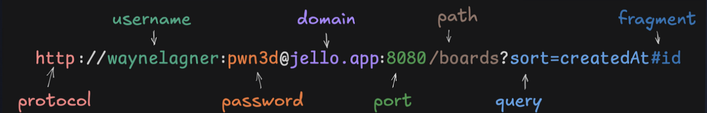

# Backend Web Development Using Go
__Contents__:
- [__HTTP Clients__](#http-clients)
    - [JSON](#json)
    - [DNS](#dns)
	- [URIs](#uris)
	- [Headers](#methods)
	- [Methods](#methods)
	- [HTTPS](#https)
	- [Errors](#errors)
	- [cURL](#curl)
- [__HTTP Servers__]
- [__Web Security__]

## HTTP Clients
Computers need to speak the same language (protocol) to communicate over the internet. The most used protocol is __HTTP__ (Hypertext Transfer Protocol). It is an __application-layer__ network protocol that defines a standardized, plain-text format for client and server computers to send requests and receive responses over the internet.

Benefits of Using HTTP:
- __Language Agnostic__: Request and responses can be sent from any program written in different languages.
- __Statelessness__: Each HTTP request is completely independent and contains all the information necessary to complete it. The server doesn't need to hold open a permanent, memory-heavy connection for every client on earth.
- __Structured and Human Readable__: HTTP messages are in plain-text with distinct components:
    - __Method__: Tells the server what action to take.
    - __URL/Path__: Specifies which resource is being requested.
    - __Headers__: key-value pairs providing metadata.
    - __Body__: The actual payload, normally in JSON.

A __Uniform Resource Locator (URL)__ is the address of another computer or server on the internet, with part of it specifying where to reach the server and the other part stating the information needed, such as `https//:www.hello.com/greet`. The `http` indicates that the __http__ protocol is being used.

In the request and response model the client is the computer that asks for information, while the server is the computer that responds by sending information. The `net/http` standard package allows requests to be made with methods like `http.Client` and `http.Get` which uses `http.defaultClient` under the hood.
| Function / Method | Example Code | Why It's Important / Primary Use Case |
| :--- | :--- | :--- |
| **`http.Get`** | `resp, err := http.Get("https://api.example.com/users")` | **Quick Reads:** Fetches data from a URL using an HTTP `GET` request. Best for simple queries where default client settings are sufficient. |
| **`http.Post`** | `resp, err := http.Post(url, "application/json", bodyReader)` | **Data Creation:** Sends data (like a JSON payload) to a server using a `POST` request to create new resources. |
| **`http.PostForm`** | `resp, err := http.PostForm(url, url.Values{"key": {"val"}})` | **Form Submissions:** Sends HTML form data (`application/x-www-form-urlencoded`) natively without manually formatting headers. |
| **`http.NewRequest`** | `req, err := http.NewRequest("PUT", url, bodyReader)` | **Custom Requests:** Creates a customizable request object (`*http.Request`). Required for HTTP verbs like `PUT`, `DELETE`, or `PATCH`, or when adding custom Headers (e.g., Auth tokens). |
| **`client.Do`** | `resp, err := client.Do(req)` | **Execution Engine:** Executes an `*http.Request` created by `NewRequest`. Lets you reuse custom `http.Client` configurations (timeouts, redirects). |
| **`http.Client{...}`** | `client := &http.Client{Timeout: 10 * time.Second}` | **Production Safety:** Configures client behavior. Crucial for setting global timeouts so your Go app doesn't hang indefinitely on slow responses. |
| **`resp.Body.Close`** | `defer resp.Body.Close()` | **Resource Cleanup:** Closes the response body network stream. **Mandatory** to prevent memory/connection leaks in Go network applications. |

__Important Mechanics__:
- Creating Custom Requests: Use `http.NewRequest` with `client.Do` because `http.Get` and `http.Post` use the unconfigured `httpDefaultClient` under the hood which has no timeout.
- Always Defer `resp.Body.Close`: Whenever `http.Get()`, `http.Post()`, or `client.Do()` succeeds (when `err == nil`), the Go runtime opens an active network connection to stream the response data. If you forget to call `resp.Body.Close()`, that connection is never returned to the system pool. If your server processes thousands of requests, it will quickly run out of socket file descriptors and crash!

```go
package main

import (
	"net/http"
	"time"
)

func main() {
	// 1. Create a safe client with a 5-second timeout
	client := &http.Client{
		Timeout: 5 * time.Second,
	}

	// 2. Build a custom request (needed for PUT, DELETE, or setting Headers)
	req, err := http.NewRequest("DELETE", "https://api.example.com/users/123", nil)
	if err != nil {
		return
	}

	// 3. Attach custom metadata / auth headers
	req.Header.Set("Authorization", "Bearer MY_SECRET_TOKEN")

	// 4. Execute the request
	resp, err := client.Do(req)
	if err != nil {
		return
	}
	defer resp.Body.Close() // ALWAYS close the body!
}
```
### JSON
__JavaScript Object Notation__ is the standard for transferring data across the web with the HTTP protocol. It is a __stringified__ version Javascript's object syntax and supports types like:
- __Primitive__: String, Numbers, Booleans, and Null
- __Collections__: Arrays, Object literals like dictionaries

It is commonaly used in:
- __HTTP__: in the body of the request and response objects.
- __Text files__: as configuration file (`.json`).
- __DBs__: In NoSQL databases like MongoDB, ElasticSearch, and Firestore

With JSON the keys are always strings, whereas the values can be any type it supports.
```json
{
    "movies": [
        {
            "id": 1,
            "title": "Iron Man",
            "director": "Jon Favreau",
            "favorite": true
        },
        {
            "id": 2,
            "title": "The Avengers",
            "director": "Joss Whedon",
            "favorite": false
        }
    ]
}
```
Using backticks in Go makes in easier to write JSON data through string literals.

JSON data is sent in the body of an HTTP response in the form of __bytes__ which need to be __decoded__. In Go, a __struct__ is used to decode the the data which requires knowing the JSON fields and their types. The `encoding/json` package provides a _compile time type-safety_ way to do so. To tell the translator how Go struct fields map to JSON keys, Go uses Struct Tags—metadata annotations written inside backticks `json:"..."`. The struct fields must be __capitalised__ and exported for the `encoding/json` package to access them. Use struct tags to map uppercase Go field names to lowercase JSON keys.
```go
type User struct {
	ID        int    `json:"id"`                 // Maps 'ID' to "id" in JSON
	Name      string `json:"full_name"`          // Maps 'Name' to "full_name"
	Email     string `json:"email,omitempty"`    // Omits field if empty/zero-value
	Password  string `json:"-"`                  // Ignores this field completely
}
```
When the response is received the values can be decoded into a _slice_ using the `&` _address of operator_.
```go
// The response is successful: http.Response
var users []User
decoder := json.NewDecoder(res.Body)
if err := decoder.Decode(&users); err != nil {
    fmt.Println("error decoding response")
    return
}
// If no error occurs the slice can be used
for _, user := range users {
    fmt.Printf("User - id: %v, name: %v, email: %v", user.ID, user.Name, user,Email)
}
```
The `json.NewDecoder` reads a continuous stream of data (like an open HTTP response body) and decodes the incoming JSON directly into a Go struct using `.Decode(&var)`. When you make an HTTP request, the response body doesn't arrive instantly as a complete string, it streams over the network connection. `json.NewDecoder` reads directly from that stream (`io.Reader`) without needing to load the entire JSON response into memory first using `io.ReadAll()`.

Just like with `sync.Mutex` or `Unmarshal`, `.Decode()` needs to modify the destination variable in-place. If you don't pass a pointer (e.g., `decoder.Decode(issue)` instead of `decoder.Decode(&issue)`), Go will return a runtime error: `json: Unmarshal(non-pointer ...)`.

| Feature | `json.NewDecoder(r).Decode(&v)` | `json.Unmarshal(data, &v)` |
| :--- | :--- | :--- |
| **Input Type** | An `io.Reader` stream (like `resp.Body` or a File). | A `[]byte` slice in memory. |
| **Primary Use Case** | Reading HTTP response/request bodies or large files. | Working with in-memory JSON strings or data already in a byte array. |
| **Performance** | Memory-efficient (streams data directly without buffering all of it). | Requires loading the whole payload into RAM first. |

The `json.Unmarshal` method is used to decode data that is already in a `[]byte` format. It is better used for small programs that is already in memory.
```go
package main

import (
	"encoding/json"
	"fmt"
)

type Issue struct {
	Title string `json:"title"`
	Number int   `json:"number"`
}

func main() {
	jsonBytes := []byte(`{"title": "Fix bug in auth", "number": 42}`)

	var issue Issue
	// Unmarshal requires a pointer (&issue) so it can modify the struct
	err := json.Unmarshal(jsonBytes, &issue)
	if err != nil {
		fmt.Println("Unmarshal error:", err)
		return
	}

	fmt.Printf("Parsed: %+v\n", issue) // Parsed: {Title:Fix bug in auth Number:42}
}
```

The `json.Marshal` function converts a Go struct into a slice of bytes representing JSON data.
```go
type Board struct {
	Id       int    `json:"id"`
	Name     string `json:"name"`
	TeamId   int    `json:"team"`
	TeamName string `json:"team_name"`
}

board := Board{
	Id:       1,
	Name:     "API",
	TeamId:   9001,
	TeamName: "Backend",
}

data, err := json.Marshal(board)
if err != nil {
	log.Fatal(err)
}
fmt.Println(string(data))
// {"id":1,"name":"API","team":9001,"team_name":"Backend"}
```
#### XML
__Extensible Markup Language__ is a text format for repsenting structured information similar to _HTML_:
```xml
<root>
  <id>1</id>
  <genre>Action</genre>
  <title>Iron Man</title>
  <director>Jon Favreau</director>
</root>
```
It is used for the same things that JSON is used for. However, JSON is more lightweight and arguable easier to read.

### DNS
Computers on a network communicate using __numeric IP addresses__ to route data packets across hardware interfaces. Humans are terrible at remembering long strings of numbers. __Domain Names__ are the human readable format of an IP address. The __Domain Name System__ is a distributed, hierarchical database that translates human-readable domain names like boot.dev into machine-readable IP addresses like `198.51.100.1`. DNS allows users to type names while machines route numbers.

Deploying a website on the internet only requires for steps:
1. Create or access a server that hosts the files of the web site and connect it to the internet.
2. Acquire a domain name.
3. Connect the domain name to an IP address of the server.
4. The server is accessible via the internet.

The _domain name_ is just the host name, such `bootdev.com` and not the other parts of the URL. The `net/url` package is Go's standard library tool for parsing, constructing, and manipulating __URLs__ and query parameters safely. URLs are not just simple strings as they have formatting rules governed by internet standards like __RFC 3986__, which the package utilises. This allows URLs to be broken down into finely types structs where they can be safely used. __WHY__: Constructing URLs manually with string concatenation (e.g., `url + "?key=" + val`) easily leads to bugs, broken encodings, or security vulnerabilities like query parameter injection.

__🧠 Mental Model__: The `url.URL` object can be seen as a disassembled address label:
```plaintext
https://  user:pass@  api.example.com :8080  /v1/users  ?sort=desc&limit=10  #profile
└─Scheme─┘ └─Userinfo─┘ └──────Host─────┘└─Port─┘ └──Path───┘ └─────RawQuery─────┘  └─Fragment┘
```
- __Scheme/Protocol__: Defines the rules used to access the resource (http, https, ftp, mailto). Not all URL protocols require the `//` authority components such as `mailto:` which does not use it.
- __Authority__: Contains optional credentials (user:pass@), the domain host (example.com), and an optional port (:8042).
- __Path__: Hierarchical data identifying the specific resource on the server (/over/there).
- __Query__: Optional non-hierarchical parameters (?name=ferret).
- __Fragment__: Optional sub-resource client-side anchor (#nose).
- __Port__: The virtual points managed by a computer's OS where network connections are made. They numbers from _0 - 65, 535_ where port _0_ is reserved for the system's API. Whenever you connect to another computer over a network, you're connecting to a specific port on that computer, which is listened to by a program on that computer. A port can only be used by one program at a time, which is why there are so many possible ports. Most times the default port for HTTP (80) and HTTPS (443) are used on the internet, which aren't really visible.

When a raw string is parsed with `url.Parse()`, Go breaks that single string into a structured `*url.URL` object where each part is an explicit field you can inspect or rewrite. Common methods and functions from the `net/url` package:
| Function / Method | Example Code | Why & When To Use It |
| :--- | :--- | :--- |
| **`url.Parse`** | `u, err := url.Parse("https://api.example.com/search?q=go")` | **Parsing:** Converts a raw URL string into a structured `*url.URL` object. Use this before inspecting or modifying components of a URL. |
| **`u.Query()`** | `params := u.Query()` | **Extracting Params:** Parses the query string (`?a=1&b=2`) into a `url.Values` map (`map[string][]string`) so you can easily read parameters. |
| **`params.Get()`** | `val := params.Get("q")` | **Reading Key:** Retrieves the first value associated with a given key in a `url.Values` map. Returns `""` if the key doesn't exist. |
| **`params.Set()`** | `params.Set("limit", "10")` | **Setting/Overwriting Key:** Sets a key-value pair in `url.Values`, replacing any existing values for that key. |
| **`params.Add()`** | `params.Add("filter", "active")` | **Appending Key:** Appends a new value to a key in `url.Values` without overwriting existing values under that same key. |
| **`params.Encode()`** | `u.RawQuery = params.Encode()` | **URL Encoding:** Converts `url.Values` back into an HTTP-safe, URL-encoded query string (e.g., handles spaces like `%20` or `+`). |
| **`u.String()`** | `fullURL := u.String()` | **Reconstructing:** Reassembles the entire `*url.URL` struct back into a complete, valid URL string ready for an HTTP request. |
| **`url.QueryEscape`** | `escaped := url.QueryEscape("hello world & co")` | **Manual Encoding:** Encodes a standalone string so it can be safely used inside a URL path or query parameter. |

__Example__: (Taken from boot.dev)
```go
parsedURL, err := url.Parse("https://homestarrunner.com/toons")
if err != nil {
	fmt.Println("error parsing url:", err)
	return
}
// Extract the hostname/domain name
parsedURL.Hostname()
```
The [__Internet Corporation for Assigned Names and Numbers (ICANN)__](https://www.icann.org/) is organisation that manages DNS for the entire internet. Each computer internet requests contacts one of ICANN's _root nameservers_ whose address is configured into each computer system. From there, that nameserver can gather the domain records for a specific domain name from their distributed DNS database.

A __subdomain__ allows a domain to route network traffic to different servers and resources. For example, `bea.findher.com` is a subdomain for `findher.com`.

Building a Safe URL in Go:
```go
package main

import (
	"fmt"
	"net/url"
)

func main() {
	// 1. Parse a base URL
	baseURL, err := url.Parse("https://api.boot.dev/v1/courses")
	if err != nil {
		return
	}

	// 2. Extract existing query parameters (returns url.Values map)
	params := baseURL.Query()

	// 3. Add or update parameters safely (handles encoding automatically!)
	params.Set("sort", "name desc") // Space gets properly encoded as + or %20
	params.Add("tag", "golang")
	params.Add("tag", "backend")

	// 4. Encode params back into the URL struct's RawQuery field
	baseURL.RawQuery = params.Encode()

	// 5. Convert full struct back to string
	fmt.Println(baseURL.String())
	// Output: https://api.boot.dev/v1/courses?sort=name+desc&tag=golang&tag=backend
}
```
Easy ways the safety can be broken:
1. __Directly Mutating `Query()`: `u.Query()` returns a copy of the URL's query parameters as a map. Modifying that map directly does not update the URL until `params.Encode()` is assigned back to `u.RawQuery`.
2. __Using String Concatenation for Query Parameters__: Never build queries by concatenating strings like `baseURL + "?search=" + userInput`. If userInput contains spaces, &, or ?, it will break the URL structure or create security bugs. Always use `url.Values` and `.Encode()`

### URIs
A __Uniform Resource Identifier (URI)__ is a string os characters that identifies a resource either by name, location, or both specifically over the internet. To fetch or modify data over a network, servers and clients need a unique, unambiguous address system. URIs define that universal syntax so web systems can pinpoint precisely what resource is being acted upon. There are two common types of URIs:
1. __Uniform Resource Locator (URL)__: The _how_ and _where_ to find something. 
2. __Uniform Resource Name (URN): The _what_ that something is like an isbn number.

__Example Extracting Components of a URI__:
```go
func newParsedURL(urlString string) ParsedURL {
	parsedUrl, err := url.Parse(urlString)
	if err != nil {
		return ParsedURL{}
	}

	var username string 
	var password string 

	if parsedUrl.User != nil {
		username = parsedUrl.User.Username()
		password, _ = parsedUrl.User.Password()
	}

	return ParsedURL{
		protocol: parsedUrl.Scheme,
		username: username,
		password: password,
		hostname: parsedUrl.Hostname(),
		port:     parsedUrl.Port(),
		pathname: parsedUrl.Path,
		search:   parsedUrl.RawQuery,
		hash:     parsedUrl.Fragment,
	}
}
```
This shows that there are typical 8 components to a URL, but not all are required.

- Image BY <a href="https://www.boot.dev/lessons/2d85b1ef-5577-4f65-88ca-e4264059b7af">__Boot.dev__</a>.

### Headers
### Methods
### Paths
### HTTPS
### Errors
### cURL